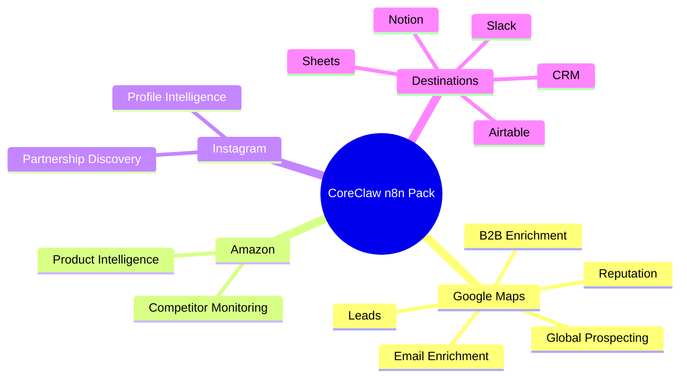
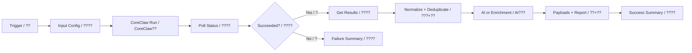

# CoreClaw n8n Commercial Workflow Pack

This repository provides mature CoreClaw-first n8n workflows for lead generation, ecommerce intelligence, social account intelligence, reputation monitoring, and sales operations. Each workflow contains bilingual node names and detailed sticky notes in English and Chinese.

## Setup

1. Import the JSON workflow into n8n.
2. Select your CoreClaw API credential on each CoreClaw node.
3. If the workflow uses AI, replace `YOUR_LLM_API_KEY` in HTTP Request nodes or move it into a credential.
4. Edit `Input Config / ????`.
5. Run manually and inspect `Success Summary / ????`.
6. Connect real Google Sheets, Airtable, Slack, Notion, Gmail, or CRM nodes to the prepared payload nodes.

## Workflow Map

## Workflows

### CoreClaw???? / Maps Leads

- **File:** `coreclaw-gmaps-leads-simple.json`
- **Use case:** Local business leads
- **Parameter example:** `keyword=dentist; base_location=Austin, Texas, USA; max_results=3`
- **How it helps:** Converts raw CoreClaw data into scored, deduplicated, business-ready records with reporting and downstream payloads.

### CoreClaw???? / Maps Email

- **File:** `coreclaw-gmaps-leads-email-extraction-simple.json`
- **Use case:** Lead email discovery
- **Parameter example:** `keyword=dentist; base_location=Austin, Texas, USA; max_results=3`
- **How it helps:** Converts raw CoreClaw data into scored, deduplicated, business-ready records with reporting and downstream payloads.

### CoreClaw B2B?? / B2B Enrich

- **File:** `coreclaw-gmaps-b2b-enrichment-simple.json`
- **Use case:** B2B AI enrichment
- **Parameter example:** `keyword=dentist; base_location=Austin, Texas, USA; max_results=3`
- **How it helps:** Converts raw CoreClaw data into scored, deduplicated, business-ready records with reporting and downstream payloads.

### CoreClaw???? / Reviews Monitor

- **File:** `coreclaw-gmaps-reviews-monitor-simple.json`
- **Use case:** Review monitoring
- **Parameter example:** `keyword=dentist; base_location=Austin, Texas, USA; max_results=2; max_reviews_per_place=3`
- **How it helps:** Converts raw CoreClaw data into scored, deduplicated, business-ready records with reporting and downstream payloads.

### CoreClaw???? / Sheets Leads

- **File:** `coreclaw-gmaps-to-sheets.json`
- **Use case:** Sheets-ready lead ops
- **Parameter example:** `keyword=dentist; base_location=Austin, Texas, USA; max_results=3`
- **How it helps:** Converts raw CoreClaw data into scored, deduplicated, business-ready records with reporting and downstream payloads.

### CoreClaw???? / Email Outreach

- **File:** `coreclaw-gmaps-leads-email-extraction.json`
- **Use case:** AI outreach pipeline
- **Parameter example:** `keyword=dentist; base_location=Austin, Texas, USA; fetch_social_info=true`
- **How it helps:** Converts raw CoreClaw data into scored, deduplicated, business-ready records with reporting and downstream payloads.

### CoreClaw Airtable?? / Airtable Pipeline

- **File:** `coreclaw-gmaps-airtable-email.json`
- **Use case:** Airtable CRM pipeline
- **Parameter example:** `keyword=dentist; base_location=Austin, Texas, USA; max_results=3`
- **How it helps:** Converts raw CoreClaw data into scored, deduplicated, business-ready records with reporting and downstream payloads.

### CoreClaw?????? / Lead Ops

- **File:** `coreclaw-gmaps-leads-complete-enhanced.json`
- **Use case:** Complete lead operations
- **Parameter example:** `keyword=dentist; base_location=Austin, Texas, USA; max_results=3`
- **How it helps:** Converts raw CoreClaw data into scored, deduplicated, business-ready records with reporting and downstream payloads.

### CoreClaw???? / Reputation Ops

- **File:** `coreclaw-gmaps-reviews-monitor.json`
- **Use case:** Advanced reputation ops
- **Parameter example:** `keyword=dentist; base_location=Austin, Texas, USA; fetch_reviews=true`
- **How it helps:** Converts raw CoreClaw data into scored, deduplicated, business-ready records with reporting and downstream payloads.

### CoreClaw???? / Global Prospecting

- **File:** `coreclaw-google-maps-leads-complete-global.json`
- **Use case:** Global prospecting
- **Parameter example:** `keyword=restaurant; base_location=Singapore; max_results=3`
- **How it helps:** Converts raw CoreClaw data into scored, deduplicated, business-ready records with reporting and downstream payloads.

### CoreClaw????? / Amazon Intel

- **File:** `coreclaw-amazon-product-intelligence.json`
- **Use case:** Amazon product intelligence
- **Parameter example:** `domain=https://www.amazon.com; keyword=coffee grinder; limit=3`
- **How it helps:** Converts raw CoreClaw data into scored, deduplicated, business-ready records with reporting and downstream payloads.

### CoreClaw Instagram???? / Instagram Intel

- **File:** `coreclaw-instagram-profile-intelligence.json`
- **Use case:** Instagram profile intelligence
- **Parameter example:** `username=instagram; limit=1`
- **How it helps:** Converts raw CoreClaw data into scored, deduplicated, business-ready records with reporting and downstream payloads.

## Parameter Guide

- `keyword`: Business category, product keyword, or search topic. Example: `dentist`, `restaurant`, `coffee grinder`.
- `base_location`: Location for Google Maps workflows. Example: `Austin, Texas, USA`.
- `max_results` / `limit`: Keep low during testing, then increase gradually.
- `wait_seconds`: Polling interval. Use larger values for bigger jobs.
- `domain`: Amazon marketplace domain, e.g. `https://www.amazon.com`.
- `username`: Instagram username without @.

## Security

No public workflow JSON contains private CoreClaw or LLM keys. Use n8n credentials or environment variables for production.
