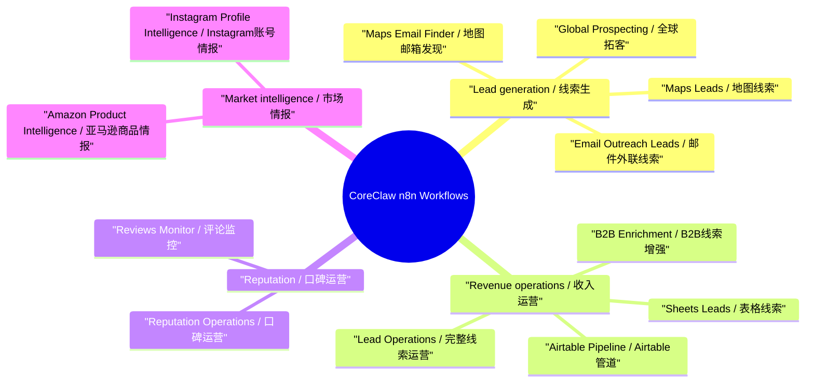

# CoreClaw n8n Commercial Workflow Pack

This repository contains 12 production-oriented n8n workflow templates for the official CoreClaw community node.

The templates are designed for daily sales, revenue operations, ecommerce intelligence, reputation operations, and partnership workflows. Each workflow produces scored records, recommended actions, and ready-to-send payloads for Google Sheets, Airtable, CRM, Slack, Notion, email drafts, and webhooks.

## What Changed

- Rebuilt all 12 workflows with bilingual English / Chinese workflow names and node names.
- Added bilingual English / Chinese sticky notes to every workflow so operators can understand purpose, inputs, flow, and outputs directly inside n8n.
- Removed orphan business nodes, disconnected NoOp queues, and stale branches while retaining intentional documentation sticky notes.
- Added commercial scoring, priority routing, CRM stages, evidence fields, and executive summaries.
- Added retry settings to CoreClaw, website fetch, and optional AI enrichment nodes.
- Added CoreClaw `systemParams` for consistent worker runtime configuration.
- Added stronger website email extraction with domain matching and placeholder/image-file filtering.
- Kept secrets out of workflow JSON. CoreClaw credentials are bound inside the local n8n instance only.

## Workflow Mind Map



## Standard Flow

```mermaid
flowchart LR
  A["Manual or schedule trigger / 手动或定时触发"] --> B["Input Config / 输入配置"]
  B --> C["Start CoreClaw Run / 启动CoreClaw任务"]
  C --> D["Wait Before Poll / 等待轮询"]
  D --> E["Get Run Status / 获取任务状态"]
  E --> F{"If Terminal / 是否结束"}
  F -- "No / 否" --> D
  F -- "Yes / 是" --> G{"If Success / 是否成功"}
  G -- "No / 否" --> H["Failure Summary / 失败摘要"]
  G -- "Yes / 是" --> I["Get Run Results / 获取任务结果"]
  I --> J["Normalize Records / 标准化记录"]
  J --> K["Remove Duplicates / 去重"]
  K --> L["Optional AI and website enrichment / 可选AI与网站增强"]
  L --> M["Prepare Destination Payloads / 准备目标系统载荷"]
  M --> N["Aggregate Results / 汇总结果"]
  N --> O["Success Summary / 成功摘要"]
```



## Workflows

| File | Workflow | Main use |
| --- | --- | --- |
| `coreclaw-gmaps-leads-simple.json` | CoreClaw Maps Leads / CoreClaw 地图线索 | Local lead scoring and CRM-ready payloads |
| `coreclaw-gmaps-leads-email-extraction-simple.json` | CoreClaw Maps Email Finder / CoreClaw 地图邮箱发现 | Lead enrichment with website email discovery |
| `coreclaw-gmaps-leads-email-extraction.json` | CoreClaw Email Outreach Leads / CoreClaw 邮件外联线索 | AI-assisted outbound pitch and next-step generation |
| `coreclaw-gmaps-b2b-enrichment-simple.json` | CoreClaw B2B Enrichment / CoreClaw B2B线索增强 | B2B account qualification and disqualification guardrails |
| `coreclaw-gmaps-leads-complete-enhanced.json` | CoreClaw Lead Operations / CoreClaw 完整线索运营 | Full lead ops pipeline with AI and website signals |
| `coreclaw-google-maps-leads-complete-global.json` | CoreClaw Global Prospecting / CoreClaw 全球拓客 | International clinic/aesthetic prospecting |
| `coreclaw-gmaps-to-sheets.json` | CoreClaw Sheets Leads / CoreClaw 表格线索 | Spreadsheet-ready lead rows |
| `coreclaw-gmaps-airtable-email.json` | CoreClaw Airtable Pipeline / CoreClaw Airtable管道 | Airtable CRM field payloads |
| `coreclaw-gmaps-reviews-monitor-simple.json` | CoreClaw Reviews Monitor / CoreClaw 评论监控 | Daily reputation monitoring |
| `coreclaw-gmaps-reviews-monitor.json` | CoreClaw Reputation Operations / CoreClaw 口碑运营 | AI-assisted reputation actions |
| `coreclaw-amazon-product-intelligence.json` | CoreClaw Amazon Product Intelligence / CoreClaw 亚马逊商品情报 | Ecommerce competitor and product opportunity intelligence |
| `coreclaw-instagram-profile-intelligence.json` | CoreClaw Instagram Profile Intelligence / CoreClaw Instagram账号情报 | Brand, creator, and partner account intelligence |

## Requirements

- n8n 2.22.5 or newer.
- `n8n-nodes-coreclaw` installed in n8n community nodes.
- A CoreClaw API credential configured in n8n.
- Optional AI enrichment: set `ASTRON_API_KEY` in the n8n runtime environment, or replace the placeholder privately inside your n8n instance.

Do not commit real API keys into these JSON files.

## Import Notes

After importing the JSON files, bind the CoreClaw credential on every `Start CoreClaw Run`, `Get Run Status`, and `Get Run Results` node.

In the bilingual templates these nodes are named `Start CoreClaw Run / 启动CoreClaw任务`, `Get Run Status / 获取任务状态`, and `Get Run Results / 获取任务结果`.

The workflow JSON intentionally contains no credential IDs. The local sync helper can bind credentials to a local n8n instance without modifying repository templates:

```powershell
$env:N8N_EMAIL="you@example.com"
$env:N8N_PASSWORD="..."
$env:ASTRON_API_KEY="..."
node tools\sync-local-n8n.js
```

## Validation

The local n8n instance was backed up before cleanup. The latest bilingual sync deleted the previous 12 English-only CoreClaw workflows and left exactly 12 current bilingual CoreClaw workflows.

Representative real executions in local n8n:

| Workflow | Execution ID | Result |
| --- | ---: | --- |
| CoreClaw Maps Leads / CoreClaw 地图线索 | 182 | Success, 3 records, avg score 59, payloads ready |
| CoreClaw Email Outreach Leads / CoreClaw 邮件外联线索 | 183 | Success, AI and website enrichment, 3 payload-ready records |
| CoreClaw Sheets Leads / CoreClaw 表格线索 | 184 | Success, spreadsheet-ready payloads, avg score 64 |
| CoreClaw Maps Email Finder / CoreClaw 地图邮箱发现 | 185 | Success, website email enrichment, 3 payload-ready records |
| CoreClaw Reviews Monitor / CoreClaw 评论监控 | 186 | Success, 2 reputation records, daily review summary |
| CoreClaw B2B Enrichment / CoreClaw B2B线索增强 | 187 | Success, B2B qualification and disqualification guidance |
| CoreClaw Lead Operations / CoreClaw 完整线索运营 | 188 | Success, full-funnel lead ops output with AI guidance |
| CoreClaw Airtable Pipeline / CoreClaw Airtable管道 | 189 | Success, Airtable/CRM payloads, 3 payload-ready records |
| CoreClaw Global Prospecting / CoreClaw 全球拓客 | 190 | Success, Singapore clinic prospecting with verified emails |
| CoreClaw Reputation Operations / CoreClaw 口碑运营 | 191 | Success, AI-assisted reputation actions |
| CoreClaw Amazon Product Intelligence / CoreClaw 亚马逊商品情报 | 192 | Success, 3 product intelligence records, avg score 63 |
| CoreClaw Instagram Profile Intelligence / CoreClaw Instagram账号情报 | 193 | Success, Tier-1 brand account intelligence, high-value record |

Repository validation checks:

- All 12 JSON files parse successfully.
- Every node name is bilingual English / Chinese.
- Every workflow contains bilingual English / Chinese sticky notes.
- No orphan business nodes or NoOp queues remain; sticky notes are intentional documentation nodes.
- No missing connection sources or targets.
- No code-node syntax errors.
- No Chinese mojibake or replacement characters are present.
- No real CoreClaw or AI API keys are present in repository files.

## Local Tools

- `tools/generate-commercial-workflows.js`: regenerates all 12 workflow JSON files from a single source of truth.
- `tools/sync-local-n8n.js`: syncs the repository workflows into a local n8n instance, binds local credentials, and removes duplicate CoreClaw workflows.
- `tools/run-local-workflow.js`: triggers a workflow through n8n REST and reads the final execution output.

These tools are operational helpers, not required for normal n8n import.
