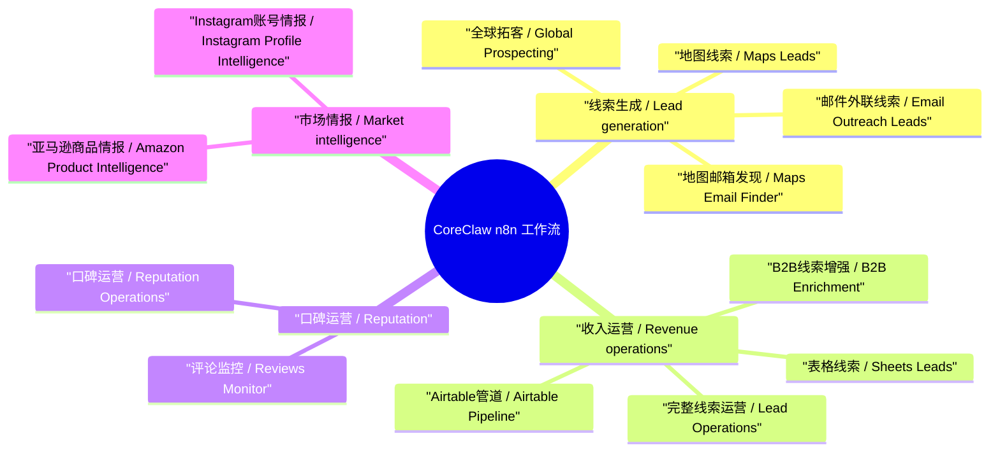

# CoreClaw n8n 商业工作流包

本仓库包含 12 个面向真实业务场景的 n8n 工作流模板，核心数据源为 CoreClaw 官方社区节点。

这些工作流不再只是演示 CoreClaw 调用，而是直接输出可进入日常运营系统的数据：线索评分、优先级、CRM 阶段、推荐动作、证据字段，以及 Google Sheets、Airtable、CRM、Slack、Notion、邮件草稿、Webhook 的目标 payload。

## 本次改造内容

- 全量重建 12 个工作流，统一使用英文 / 中文双语工作流名称和节点名称。
- 每个工作流都增加英文 / 中文双语 sticky note，运营人员在 n8n 画布内即可理解目的、输入、流程和输出。
- 清理遗弃业务节点、NoOp 队列、断开的旧分支、不可达节点和历史重复工作流；保留的 sticky note 是刻意设计的说明节点。
- 增加商业评分、优先级、CRM 阶段、行动建议、证据字段和执行摘要。
- 给 CoreClaw、网站抓取、AI HTTP 节点增加重试和容错。
- 给 CoreClaw 启动节点增加 `systemParams`，稳定 worker 运行配置。
- 强化网站邮箱提取：要求邮箱域名与目标网站匹配，并过滤占位邮箱、图片文件名、平台邮箱、开发商邮箱。
- 仓库 JSON 不包含真实 API key；本地 n8n 凭证只在本机实例中绑定。

## 思维导图



## 标准流程图

```mermaid
flowchart LR
  A["手动或定时触发 / Manual or schedule trigger"] --> B["输入配置 / Input Config"]
  B --> C["启动CoreClaw任务 / Start CoreClaw Run"]
  C --> D["等待轮询 / Wait Before Poll"]
  D --> E["获取任务状态 / Get Run Status"]
  E --> F{"是否结束 / If Terminal"}
  F -- "否 / No" --> D
  F -- "是 / Yes" --> G{"是否成功 / If Success"}
  G -- "否 / No" --> H["失败摘要 / Failure Summary"]
  G -- "是 / Yes" --> I["获取任务结果 / Get Run Results"]
  I --> J["标准化记录 / Normalize Records"]
  J --> K["去重 / Remove Duplicates"]
  K --> L["可选AI与网站增强 / Optional AI and website enrichment"]
  L --> M["准备目标系统载荷 / Prepare Destination Payloads"]
  M --> N["汇总结果 / Aggregate Results"]
  N --> O["成功摘要 / Success Summary"]
```



## 工作流清单

| 文件 | 工作流 | 业务用途 |
| --- | --- | --- |
| `coreclaw-gmaps-leads-simple.json` | CoreClaw Maps Leads / CoreClaw 地图线索 | 本地地图线索评分和 CRM payload |
| `coreclaw-gmaps-leads-email-extraction-simple.json` | CoreClaw Maps Email Finder / CoreClaw 地图邮箱发现 | 地图线索加网站邮箱发现 |
| `coreclaw-gmaps-leads-email-extraction.json` | CoreClaw Email Outreach Leads / CoreClaw 邮件外联线索 | AI 外联话术、下一步动作和邮箱线索 |
| `coreclaw-gmaps-b2b-enrichment-simple.json` | CoreClaw B2B Enrichment / CoreClaw B2B线索增强 | B2B 账户资格判断和排除规则 |
| `coreclaw-gmaps-leads-complete-enhanced.json` | CoreClaw Lead Operations / CoreClaw 完整线索运营 | 完整线索运营：评分、AI、网站信号、payload |
| `coreclaw-google-maps-leads-complete-global.json` | CoreClaw Global Prospecting / CoreClaw 全球拓客 | 国际医美/诊所拓客和市场优先级 |
| `coreclaw-gmaps-to-sheets.json` | CoreClaw Sheets Leads / CoreClaw 表格线索 | 可直接写入表格的线索行 |
| `coreclaw-gmaps-airtable-email.json` | CoreClaw Airtable Pipeline / CoreClaw Airtable管道 | Airtable CRM 字段 payload |
| `coreclaw-gmaps-reviews-monitor-simple.json` | CoreClaw Reviews Monitor / CoreClaw 评论监控 | 每日口碑/评论监控 |
| `coreclaw-gmaps-reviews-monitor.json` | CoreClaw Reputation Operations / CoreClaw 口碑运营 | AI 辅助口碑运营动作 |
| `coreclaw-amazon-product-intelligence.json` | CoreClaw Amazon Product Intelligence / CoreClaw 亚马逊商品情报 | 亚马逊商品竞品和机会情报 |
| `coreclaw-instagram-profile-intelligence.json` | CoreClaw Instagram Profile Intelligence / CoreClaw Instagram账号情报 | 品牌、达人、合作伙伴账号情报 |

## 使用要求

- n8n 2.22.5 或更高版本。
- n8n 已安装 `n8n-nodes-coreclaw` 社区节点。
- n8n 中已配置 CoreClaw API 凭证。
- 如需 AI 增强，在 n8n 运行环境中设置 `ASTRON_API_KEY`，或只在私有 n8n 实例里替换 HTTP 节点的占位值。

不要把真实 API key 写入仓库 JSON。

## 导入说明

导入 JSON 后，需要在所有 CoreClaw 节点上选择 CoreClaw 凭证，包括：

- `Start CoreClaw Run / 启动CoreClaw任务`
- `Get Run Status / 获取任务状态`
- `Get Run Results / 获取任务结果`

本仓库提供本地同步脚本，可在不修改仓库 JSON 的情况下，把工作流同步到本地 n8n 并绑定本地凭证：

```powershell
$env:N8N_EMAIL="you@example.com"
$env:N8N_PASSWORD="..."
$env:ASTRON_API_KEY="..."
node tools\sync-local-n8n.js
```

## 本地清理和验收

执行清理前已备份本地 n8n 数据库和导出工作流。最新双语同步删除了此前 12 个英文版 CoreClaw 工作流，本地 n8n 当前只保留 12 个最终双语版 CoreClaw 工作流。

本地 n8n 真实执行验收记录：

| 工作流 | Execution ID | 结果 |
| --- | ---: | --- |
| CoreClaw Maps Leads / CoreClaw 地图线索 | 182 | 成功，3 条线索，平均分 59，payload 完整 |
| CoreClaw Email Outreach Leads / CoreClaw 邮件外联线索 | 183 | 成功，AI 和网站增强，3 条 payload-ready 记录 |
| CoreClaw Sheets Leads / CoreClaw 表格线索 | 184 | 成功，表格 payload，平均分 64 |
| CoreClaw Maps Email Finder / CoreClaw 地图邮箱发现 | 185 | 成功，网站邮箱增强，3 条 payload-ready 记录 |
| CoreClaw Reviews Monitor / CoreClaw 评论监控 | 186 | 成功，2 条口碑记录，每日评论摘要 |
| CoreClaw B2B Enrichment / CoreClaw B2B线索增强 | 187 | 成功，B2B 资格判断和排除建议 |
| CoreClaw Lead Operations / CoreClaw 完整线索运营 | 188 | 成功，完整线索运营输出和 AI 建议 |
| CoreClaw Airtable Pipeline / CoreClaw Airtable管道 | 189 | 成功，Airtable/CRM payload，3 条 payload-ready 记录 |
| CoreClaw Global Prospecting / CoreClaw 全球拓客 | 190 | 成功，新加坡诊所拓客，包含验证邮箱 |
| CoreClaw Reputation Operations / CoreClaw 口碑运营 | 191 | 成功，AI 辅助口碑运营动作 |
| CoreClaw Amazon Product Intelligence / CoreClaw 亚马逊商品情报 | 192 | 成功，3 条商品情报记录，平均分 63 |
| CoreClaw Instagram Profile Intelligence / CoreClaw Instagram账号情报 | 193 | 成功，一线品牌账号情报，高价值记录 |

仓库结构校验：

- 12 个 JSON 均可解析。
- 每个节点名称都包含英文 / 中文双语表达。
- 每个工作流都包含英文 / 中文双语 sticky note。
- 不存在遗弃业务节点或 NoOp 队列；sticky note 是刻意保留的说明节点。
- 不存在缺失连接源或目标节点。
- Code 节点语法校验通过。
- 不存在中文乱码或替换字符。
- 仓库中不存在真实 CoreClaw 或 AI API key。

## 工具脚本

- `tools/generate-commercial-workflows.js`：从统一源生成全部 12 个工作流 JSON。
- `tools/sync-local-n8n.js`：把仓库工作流同步到本地 n8n、绑定本地凭证、删除重复 CoreClaw 工作流。
- `tools/run-local-workflow.js`：通过 n8n REST 触发工作流，并读取最终执行输出。

这些脚本用于本地维护和验收，普通导入 n8n 时不是必需步骤。
