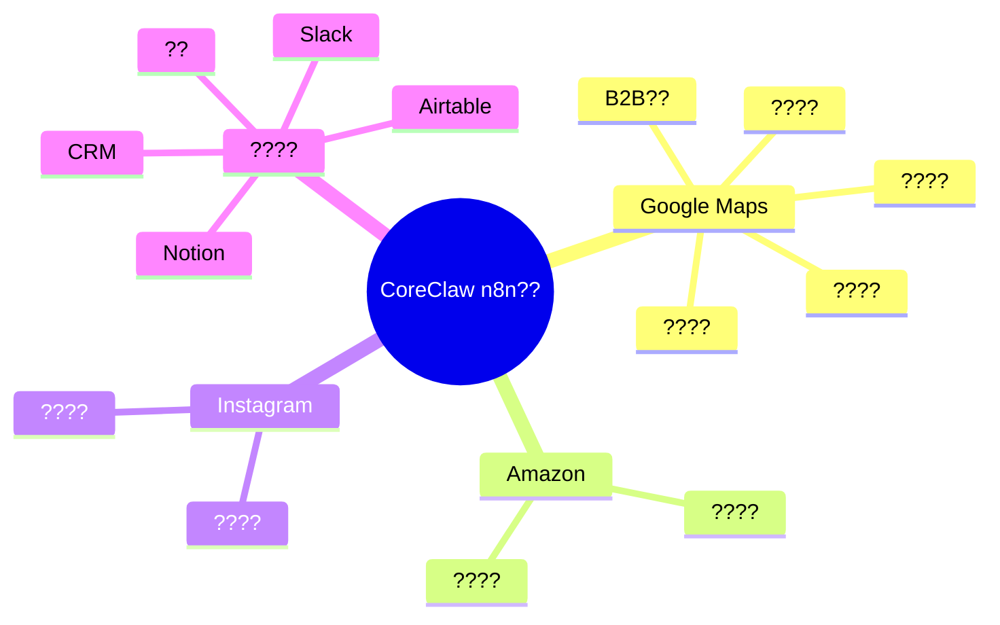
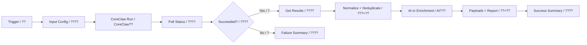

# CoreClaw n8n ???????

???????? CoreClaw ?? n8n ????????????????????????????????????????????????????????????????

## ????

1. ? n8n ??? JSON ????
2. ??? CoreClaw ?????? CoreClaw API ???
3. ??????? AI???? HTTP Request ???? `YOUR_LLM_API_KEY`????? n8n ???
4. ?? `Input Config / ????`?
5. ??????? `Success Summary / ????`?
6. ??????????????? Google Sheets?Airtable?Slack?Notion?Gmail ? CRM?

## ??????

## ?????

### CoreClaw???? / Maps Leads

- **???** `coreclaw-gmaps-leads-simple.json`
- **?????** ??????
- **?????** `keyword=dentist; base_location=Austin, Texas, USA; max_results=3`
- **?????** ? CoreClaw ???????????????????????????????????????

### CoreClaw???? / Maps Email

- **???** `coreclaw-gmaps-leads-email-extraction-simple.json`
- **?????** ??????
- **?????** `keyword=dentist; base_location=Austin, Texas, USA; max_results=3`
- **?????** ? CoreClaw ???????????????????????????????????????

### CoreClaw B2B?? / B2B Enrich

- **???** `coreclaw-gmaps-b2b-enrichment-simple.json`
- **?????** B2B AI??
- **?????** `keyword=dentist; base_location=Austin, Texas, USA; max_results=3`
- **?????** ? CoreClaw ???????????????????????????????????????

### CoreClaw???? / Reviews Monitor

- **???** `coreclaw-gmaps-reviews-monitor-simple.json`
- **?????** ????
- **?????** `keyword=dentist; base_location=Austin, Texas, USA; max_results=2; max_reviews_per_place=3`
- **?????** ? CoreClaw ???????????????????????????????????????

### CoreClaw???? / Sheets Leads

- **???** `coreclaw-gmaps-to-sheets.json`
- **?????** ??????
- **?????** `keyword=dentist; base_location=Austin, Texas, USA; max_results=3`
- **?????** ? CoreClaw ???????????????????????????????????????

### CoreClaw???? / Email Outreach

- **???** `coreclaw-gmaps-leads-email-extraction.json`
- **?????** AI????
- **?????** `keyword=dentist; base_location=Austin, Texas, USA; fetch_social_info=true`
- **?????** ? CoreClaw ???????????????????????????????????????

### CoreClaw Airtable?? / Airtable Pipeline

- **???** `coreclaw-gmaps-airtable-email.json`
- **?????** Airtable CRM??
- **?????** `keyword=dentist; base_location=Austin, Texas, USA; max_results=3`
- **?????** ? CoreClaw ???????????????????????????????????????

### CoreClaw?????? / Lead Ops

- **???** `coreclaw-gmaps-leads-complete-enhanced.json`
- **?????** ??????
- **?????** `keyword=dentist; base_location=Austin, Texas, USA; max_results=3`
- **?????** ? CoreClaw ???????????????????????????????????????

### CoreClaw???? / Reputation Ops

- **???** `coreclaw-gmaps-reviews-monitor.json`
- **?????** ??????
- **?????** `keyword=dentist; base_location=Austin, Texas, USA; fetch_reviews=true`
- **?????** ? CoreClaw ???????????????????????????????????????

### CoreClaw???? / Global Prospecting

- **???** `coreclaw-google-maps-leads-complete-global.json`
- **?????** ????
- **?????** `keyword=restaurant; base_location=Singapore; max_results=3`
- **?????** ? CoreClaw ???????????????????????????????????????

### CoreClaw????? / Amazon Intel

- **???** `coreclaw-amazon-product-intelligence.json`
- **?????** ???????
- **?????** `domain=https://www.amazon.com; keyword=coffee grinder; limit=3`
- **?????** ? CoreClaw ???????????????????????????????????????

### CoreClaw Instagram???? / Instagram Intel

- **???** `coreclaw-instagram-profile-intelligence.json`
- **?????** Instagram????
- **?????** `username=instagram; limit=1`
- **?????** ? CoreClaw ???????????????????????????????????????

## ??????

- `keyword`????????????????????`dentist`?`restaurant`?`coffee grinder`?
- `base_location`?Google Maps ??????????????`Austin, Texas, USA`?
- `max_results` / `limit`???????????????????
- `wait_seconds`???????????????
- `domain`?Amazon ??????? `https://www.amazon.com`?
- `username`?Instagram ??????? @?

## ????

????? JSON ????? CoreClaw API Key ???? Key????????? n8n ????????
